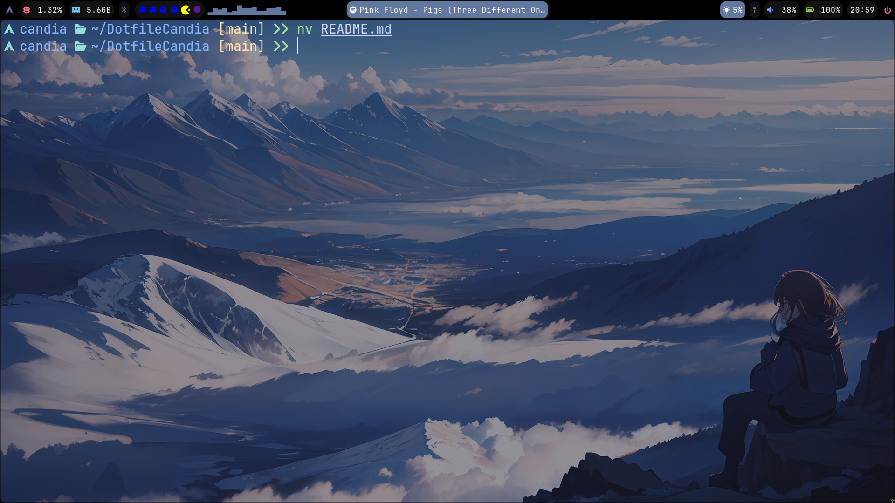

DotfileCandia

Personal Arch Linux + Hyprland setup.

Minimal, clean and Tokyo Night inspired rice.

🖥️ Environment

WM: Hyprland

Bar: Waybar (custom modules + Spotify MPRIS + Cava)

Terminal: Kitty

Shell: Zsh + Powerlevel10k

Editor: Neovim (LazyVim)

System Info: Fastfetch

✨ Features

Spotify (Flatpak) integration via MPRIS

Cava audio visualizer in Waybar

Custom media module

Bluetooth status indicator

Volume & brightness popups

Power menu (wlogout)

Persistent Hyprland workspaces

Nerd Font icons

Tokyo Night color scheme

📂 Structure
.config/
├── cava
├── fastfetch
├── hypr
├── kitty
├── nvim
└── waybar
📦 Required Packages (Arch Linux)

Install base packages:

sudo pacman -S \
hyprland waybar kitty neovim zsh fastfetch \
playerctl light networkmanager blueman \
pavucontrol rofi cava \
pacman-contrib ttf-jetbrains-mono-nerd papirus-icon-theme

AUR packages:

yay -S hyprpaper wlogout paru
🎵 Spotify (Flatpak)

Install:

flatpak install flathub com.spotify.Client

(Optional) Fix scaling issues:

flatpak override --user com.spotify.Client --env=ELECTRON_FORCE_DEVICE_SCALE_FACTOR=0.9
🚀 Installation

Clone the repository:

git clone https://github.com/cuter177/DotfileCandia.git
cd DotfileCandia

Copy configs:

cp -r .config ~/
cp .zshrc ~/

Reload Hyprland:

hyprctl reload
🖼️ Preview

Add your screenshots here:

⚠️ Notes

Designed for Arch Linux.

Uses Nerd Fonts for icons.

Waybar depends on custom scripts located in:

~/.config/waybar/scripts/

Make sure scripts are executable:

chmod +x ~/.config/waybar/scripts/*.sh
👤 Author

Alfredo Ramírez Candia
