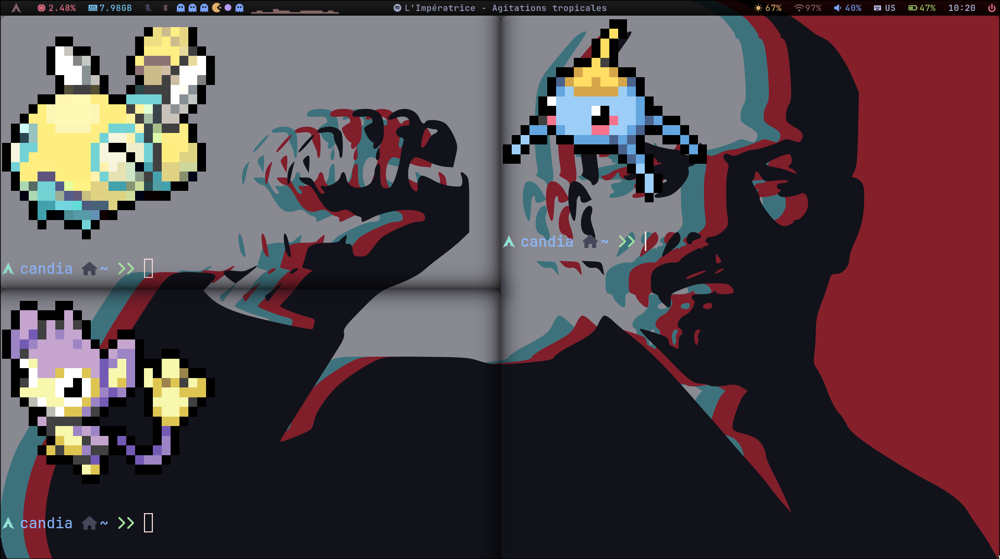

# DotfileCandia

Personal Arch Linux + Hyprland setup. Minimal, clean, Tokyo Night inspired.

There are two installers:

- **Full rice (Arch only):** Hyprland, Waybar, themes, Zsh, Kitty, and extra apps
- **Shell only (Arch, Debian/Ubuntu, Fedora):** Zsh + Oh My Zsh + plugins + Kitty, for other distros and other machines

---

## Environment

- **WM:** Hyprland
- **Bar:** Waybar (custom modules + Spotify MPRIS + Cava)
- **Wallpaper:** swww + Waypaper
- **Notifications:** Mako
- **Terminal:** Kitty
- **Launchers:** Rofi / Wofi
- **Shell:** Zsh + Oh My Zsh (custom prompt; `.p10k.zsh` is copied but not enabled)
- **Editor:** Neovim (NvChad)
- **System info:** Fastfetch

---

## Clone

Configure an SSH key, then:

```bash
git clone git@github.com:cuter177/DotfileCandia.git
cd DotfileCandia
```

---

## Full rice (Arch)

```bash
./scripts/install/install.sh
./scripts/install/install.sh --dry-run
./scripts/install/install.sh --skip-apps
```

`--skip-apps` skips Spotify (Flatpak), Zen Browser (AUR), and extra Thunderbird handling. `--skip-nvm` and `--skip-kitty` are forwarded to the shell installer.

What it does:

1. Installs pacman + AUR packages (uses `yay` or `paru`; installs `yay` if neither exists)
2. Copies configs into `~/.config` (existing dirs are backed up as `*.bak-YYYYMMDD`)
3. Installs Zsh + Kitty via `shell.sh`
4. Installs extra apps unless `--skip-apps`

After install:

1. Log out and start Hyprland
2. Put wallpapers in `~/Wallpaper-Bank/wallpapers` and set one with Waypaper
3. If the display is wrong, edit `~/.config/hypr/hyprland.local.conf` (that file is machine-specific and is not synced back to the repo)

Brightness uses `brightnessctl`. Wallpapers use **swww**, not hyprpaper.

---

## Shell + Kitty only (any supported distro)

Use this on another computer, another distro, or a machine without Hyprland:

```bash
./scripts/install/shell.sh
./scripts/install/shell.sh --dry-run
./scripts/install/shell.sh --skip-kitty
./scripts/install/shell.sh --skip-nvm
```

Installs Zsh, Oh My Zsh, `zsh-autosuggestions`, `zsh-syntax-highlighting`, `zsh-history-substring-search`, copies `.zshrc` / `.p10k.zsh`, copies Kitty config, and optionally NVM. `eza` / `fastfetch` / Nerd Fonts are installed when the distro package exists; aliases in `.zshrc` no-op if a command is missing.

---

## Syncing this machine back to the repo

```bash
./scripts/sync-dotfiles.sh
```

Copies live configs into the clone and stages them. It does **not** commit, and it does **not** overwrite `hyprland.local.conf` in the repo.

---

## Layout

```bash
.config/
├── cava
├── fastfetch
├── gtk-3.0
├── gtk-4.0
├── hypr
├── kitty
├── mako
├── nvim
├── qt5ct
├── qt6ct
├── rofi
├── waybar
├── waypaper
├── wofi
└── xdg-desktop-portal
scripts/
├── install/          # install.sh, shell.sh, packages.sh, ...
└── sync-dotfiles.sh
```

Machine-specific monitors and devices go in `~/.config/hypr/hyprland.local.conf`.

---

## Other distros (Hyprland)

The **window manager rice is Arch-only**. Debian/Ubuntu and Fedora can use `./scripts/install/shell.sh` for Zsh + Kitty.

Hyprland on those distros is not installed by these scripts. Package names, portals, and versions differ; use the Hyprland wiki and expect to adapt configs by hand.

---

## Features

- Spotify (Flatpak) via MPRIS
- Cava visualizer in Waybar
- Bluetooth, volume, and brightness popups
- Power menu (wlogout)
- Persistent Hyprland workspaces
- Nerd Font icons
- Tokyo Night color scheme

---

## Preview



---

## Notes

- Designed for **Arch Linux**
- Waybar scripts live in `~/.config/waybar/scripts/`
- Browser bind prefers `zen-browser` (AUR), then `zen`, then `~/.tarball-installations/zen/zen`
- IntelliJ, Android SDK, Homebrew, and similar PATH entries in `.zshrc` are optional leftovers and are not installed

---

## Credits

Inspired by https://github.com/FernuDev/Hypr-dotfiles  
Thanks to **FernuDev** for the original configuration.

## Author

**Alfredo Ramírez Candia**
